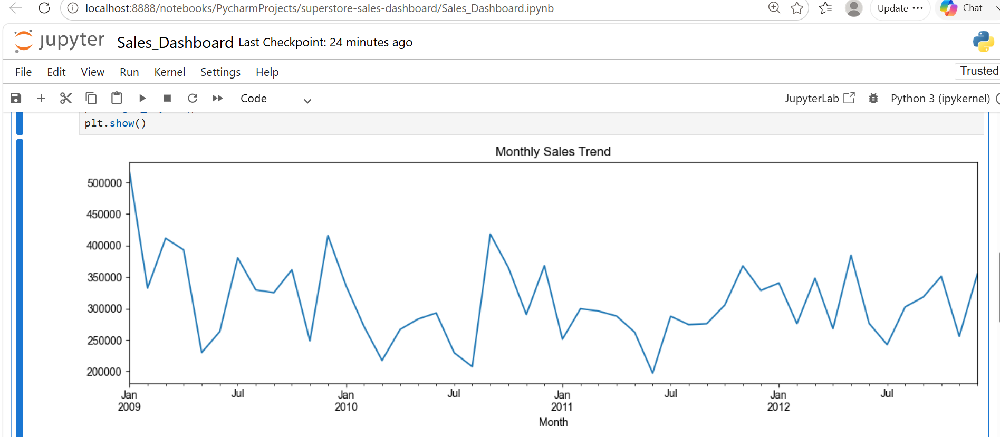

# Superstore Sales Dashboard

Analysis of 8,399 retail transactions to surface top-performing regions, identify underperforming segments, and understand what drives profit across categories and customer segments.



## What I Did
- Loaded and cleaned 8,399 transactions across 21 columns (2009–2012, Canada)
- Analysed sales and **profit** by region, category, sub-category, and customer segment
- Calculated profit margin per category to separate high-revenue from high-profit products
- Identified sub-categories generating net losses
- Quantified the impact of discount rate on per-order profit
- Mapped monthly sales trends and confirmed Q4 seasonality across all four years
- Ranked top 10 products by revenue and flagged which are actually loss-making

## Key Findings
- The **West region** led on total sales at **$3.6M** — check the profit chart to see if profitability follows
- **Nunavut** had the lowest sales at **$116K** — a 31x gap vs the West
- **Q4 consistently spiked** across all years — seasonal demand should drive inventory planning
- Orders with **discounts above 30%** frequently generated negative profit
- Several sub-categories with high sales volume are running at a **net loss** after discounts
- Technology had the highest average order value despite fewer orders than Office Supplies

## Business Recommendation
Discount policy is the most directly controllable lever. Reducing deep discounts (>30%) on low-margin sub-categories would improve profitability without requiring new revenue. Nunavut's underperformance warrants investigation — it may reflect a distribution gap rather than a demand problem.

## Tools Used
Python · Pandas · Matplotlib · Jupyter Notebook

## Setup
```bash
pip install -r requirements.txt
jupyter notebook Sales_Dashboard.ipynb
```

Run all cells in order (Kernel → Restart & Run All).

## Dataset
[Sample Superstore dataset](https://www.kaggle.com/datasets/vivek468/superstore-dataset-final) — Kaggle
